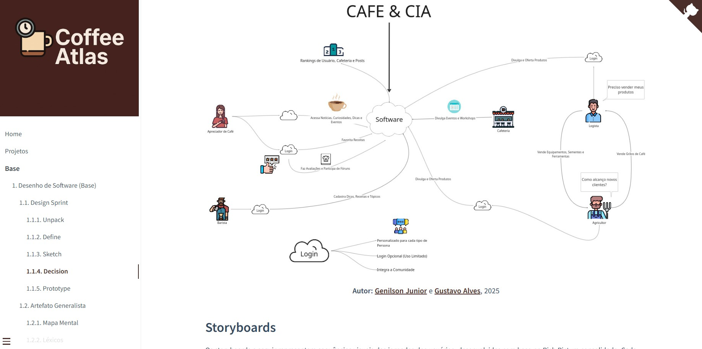
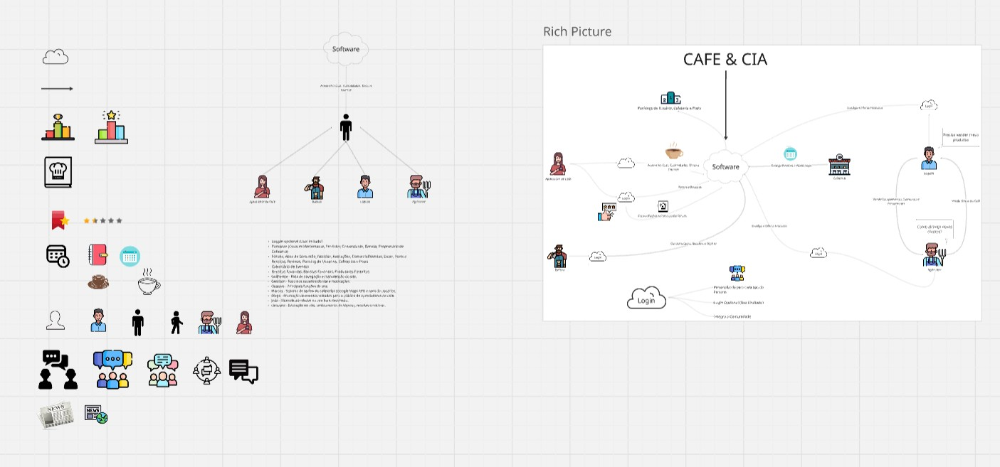
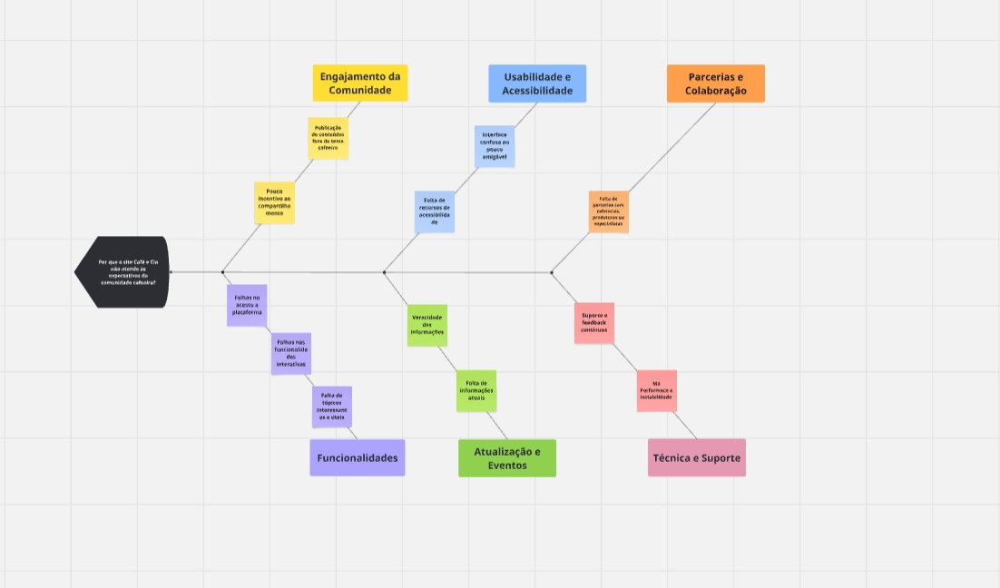
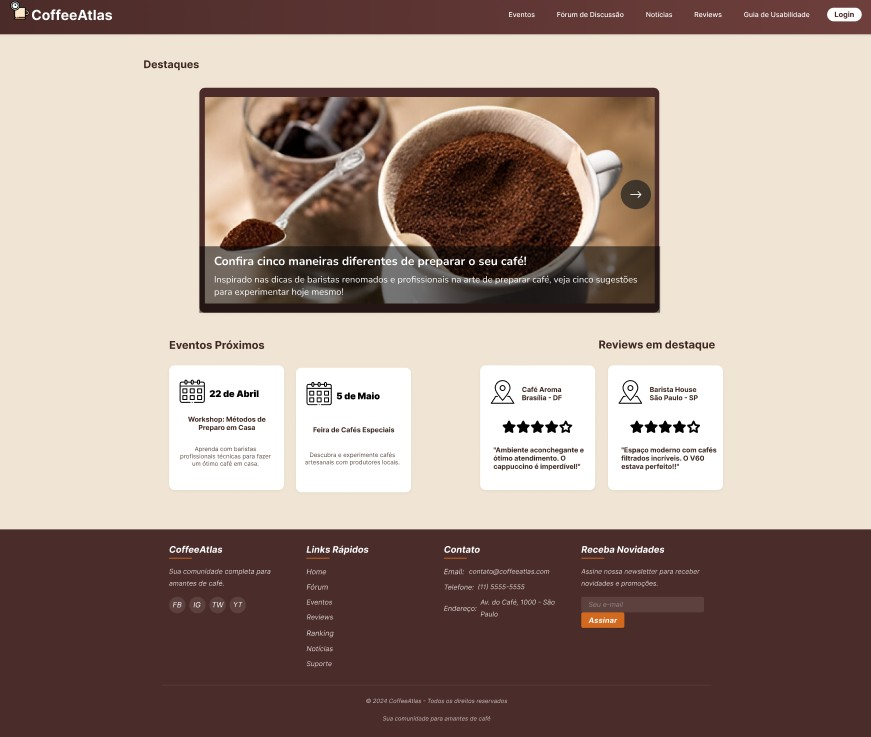

# ☕ Coffee Atlas

**Código da Disciplina**: FGA0208 
**Número do Grupo**: 06 
**Entrega**: 01 

## Alunos

|Matrícula | Aluno |
| -- | -- |
| 22/1007690  |  [Diego Carlito Rodrigues de Souza](https://github.com/DiegoCarlito) |
| 21/1030747  |  [Filipe Carvalho da Silva](https://github.com/Filipe-002) |
| 20/2045482  |  [Genilson Silva de Araújo Júnior](https://github.com/GenilsonJrs) |
| 21/1031708  |  [Geovane Alessandro dos Santos Freitas](https://github.com/GeovaneSFT) |
| 20/2016364  |  [Guilherme Coelho Mendonça](https://github.com/Guilermanoo) |
| 21/1063111  |  [Gustavo Alves de Souza](https://github.com/gustaallves) |
| 22/1022014  |  [João Vitor Lopes Ribeiro](https://github.com/Joa0V) |
| 22/1008300  |  [Marcos Antonio Teles de Castilhos](https://github.com/Marcosatc147) |
| 21/1062802  |  [Nicollas Gabriel Oliveira Sousa](https://github.com/Nicollaxs) |
| 21/1031486  |  [Samuel Ribeiro Da Costa](https://github.com/Samuelricosta) |

## Sobre 

Este trabalho foi desenvolvido para a disciplina de Arquitetura e Desenvolvimento de Software da Universidade de Brasília (UnB), com o objetivo de aplicar, na prática, as etapas iniciais de um projeto de software. O projeto escolhido pelo grupo foi o Café e Cia, uma proposta de aplicativo voltado para a comunidade que ama café, desde consumidores iniciantes até baristas, produtores e especialistas.

A ideia surgiu a partir do interesse em criar um espaço digital colaborativo, onde os usuários possam compartilhar dicas, métodos de preparo, equipamentos e experiências com cafés especiais. A cada etapa do projeto, buscamos entender melhor os perfis dos nossos usuários e quais problemas reais nossa solução pode resolver.

Para isso, utilizamos como base o processo do Design Sprint, focando principalmente nas fases iniciais como Define, que nos ajudou a organizar as informações e alinhar a equipe em torno de um problema claro. Referências como o Google Design Sprint Kit e autores como Sommerville reforçaram a importância de definir bem o que precisa ser resolvido antes de pensar em soluções.

## Screenshots da Primeira Entrega

Abaixo, as figuras de partes do projeto geral.

  
<b>Figura 1 – Rich Picture</b>

    

<b>Autor:</b>  [Toda a equipe](), 2025

<b>Figura 2 – Miro</b>

  

    

<b>Autor:</b>  [Toda a equipe](), 2025

<b>Figura 3 – Fluxo</b>

  

    

<b>Autor:</b>  [Toda a equipe](), 2025

<b>Figura 4 – Prototipo</b>

  

    

<b>Autor:</b>  [Toda a equipe](), 2025

## Há algo a ser executado?

( ) SIM

(✓) NÃO

## Informações Complementares

Além da definição do problema e da confecção dos artefatos, também foi importante observar a valorização de experiências colaborativas. O interesse e colaboração influenciaram diretamente a construção do escopo e de todo o projeto, reforçando a intenção e importancia de criar um ambiente de trabalho de parceria, promovendo troca de experiências e conexão entre pessoas com o mesmo interesse.

## Quadro Colaborativo (Miro)

  
<b>Quadro Colaborativo Miro</b>

  <iframe width="768" height="432" src="https://miro.com/app/live-embed/uXjVIGdBMuA=/?moveToViewport=-30172,-18840,61691,30721&embedId=989387736723" frameborder="0" scrolling="no" allow="fullscreen; clipboard-read; clipboard-write" allowfullscreen></iframe>

<b>Autor:</b>  [Toda a equipe](), 2025

## Histórico de Versão

| Versão | Data | Descrição | Autor(es) | Revisor(es) |
| :----: | :--: | :-------: | :-------: | :---------: |
| `1.0` | 08/04/2025 | Versão inicial do artefato. | [Diego Carlito](https://github.com/DiegoCarlito) |[Genilson Junior](https://github.com/GenilsonJrs) |
| `1.1` | 11/04/2025 | Alterações e adição do Miro. | [Genilson Junior](https://github.com/GenilsonJrs) |  [Gustavo Alves](https://github.com/gustaallves)|